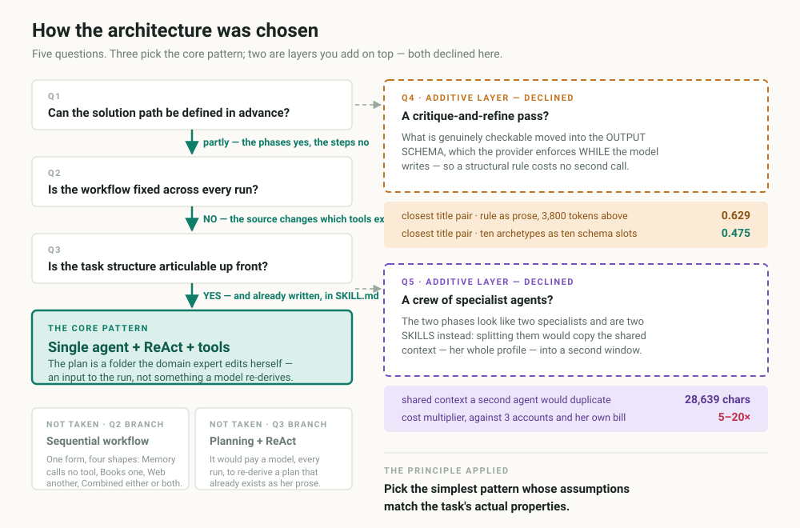
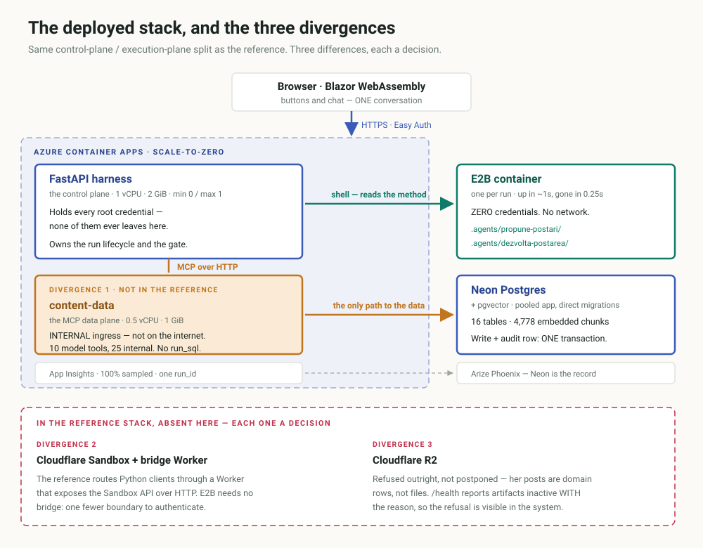
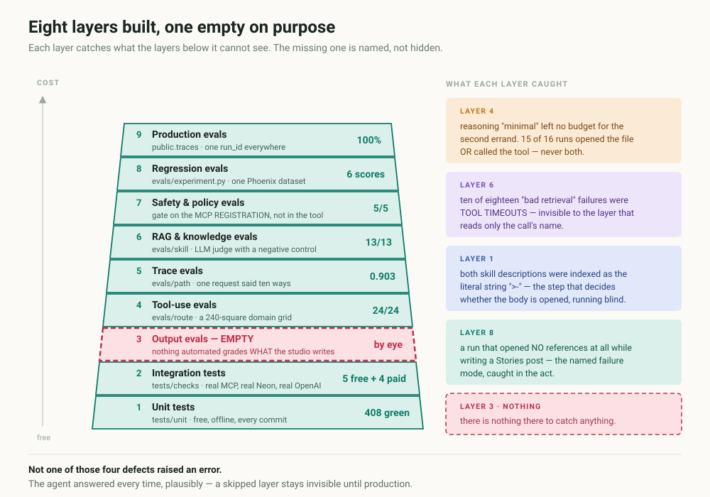
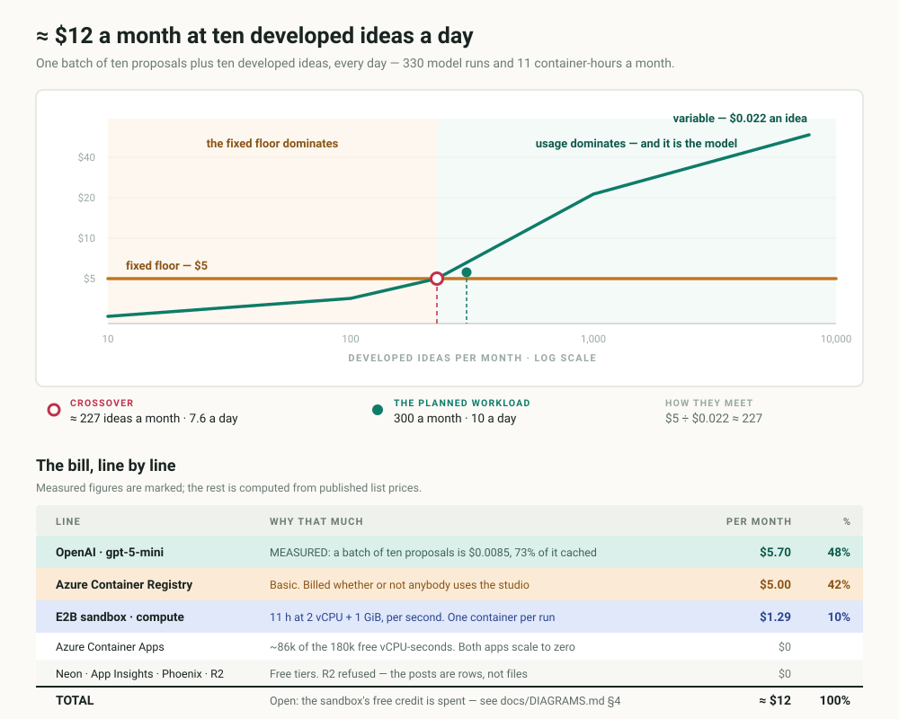

# Content Studio FTE

A **Digital FTE** — a digital full-time employee — rather than a chatbot with a
prompt. One agent does the work of a content assistant for a real
coaching business: it asks what it needs to know, gathers material from a private
library of 17 books or from the web, proposes ten posts, develops the one that is
chosen, and saves it only after a human says yes.

Built on the OpenAI Agents SDK, a purpose-built MCP server, and Neon Postgres with
pgvector. It runs in production for one client.

> **📄 [docs/CASE-STUDY.md](docs/CASE-STUDY.md)** is the same ground in prose, with
> the measurements behind each decision and five defects that only appeared
> because something was measuring. The four diagrams below are explained one by
> one in [docs/DIAGRAMS.md](docs/DIAGRAMS.md).

> **A note on language.** The agent works in Romanian, because the person it works
> for does. Everything the model reads at runtime — the system prompt, the tool
> descriptions, every file under `skills/` — is Romanian, and so is the terminal
> the client types into. Everything a developer reads — code, comments, docs,
> tests — is English. That split is deliberate and enforced throughout.

---

## The project in four diagrams

### 1 · The architecture that was chosen, and the four that were not



Three answers were forced by the task, not by preference — the source chosen in the
form decides which tools exist, so no fixed pipeline fits. The interesting half is
the two layers that were **declined**: reflection, because the checkable criteria
moved into the output schema (closest title pair **0.629 → 0.475**), and multi-agent,
because splitting would copy a **28,639-character** profile into a second context for
a **5–20×** multiplier.

### 2 · The stack that runs, and the three places it diverges



Same control-plane / execution-plane split as the reference stack. Three deliberate
differences: a **second container app on internal ingress only** for the MCP data
plane — architecture rule 1 made physical; **E2B instead of Cloudflare Sandbox and
its bridge Worker**, one fewer network boundary; and **R2 refused outright**, because
her posts are domain rows, not files — `/health` says so with the reason.

The container holds no credentials and has no network. Everything the agent can
reach, it reaches by asking the harness for a tool — and a write commits in the same
transaction as its audit row, so a saved post with no trail cannot exist.

### 3 · Eight layers of the eval pyramid built, one honestly empty



Layer 3 — output evals — is empty, and saying so is more useful than letting a stale
number stand in for it. The right-hand column is the argument for the rest: four
defects, each invisible to every layer below the one that found it, and **not one of
them raised an error.**

### 4 · What a month actually costs



A developed idea costs about **$0.022** all-in against a **$5** fixed floor, so the two
meet at ~227 ideas a month. Below that the lever is removing a line item; above it,
the model dominates and the reference course's advice applies exactly. The model half
got there by going from **$0.2490 to $0.0470 a batch** without changing the model.

---

## What makes it more than a wrapper

Six architecture rules hold the design together. They are in [AGENTS.md](AGENTS.md),
and every one of them is visible in the code:

1. **Business data moves only through the MCP server.** The worker never runs SQL
   against the business tables. There is no `run_sql` tool, no DDL, and no tool
   takes free text that a query is built from. Ten model-visible tools, and that
   is the whole surface the agent can see.
2. **The audit trail has its own connection.** A write and its audit row commit in
   the *same transaction* — a saved post with no trail cannot happen, even if the
   connection dies between the two statements.
3. **One embedding model at both ends.** Store and search with
   `text-embedding-3-small`, always. Two different models return garbage without
   complaining, so every row carries the model it was made with.
4. **Skills are folders, not code.** `SKILL.md` plus a `references/` directory,
   mounted into an E2B container and disclosed progressively by the SDK's own
   `Skills` capability: the description is always in context, the body opens when
   the task matches, a reference opens only when the skill asks for it by name.
   The method can be edited without touching Python.
5. **One agent, not a crew.** The two phases are skills, not separate agents — one
   context, so the 28,639-character client profile is not copied twice.
6. **Nothing is saved without human approval.** The gate sits on the MCP server
   *registration*, not inside the tool, so it protects every call the agent can
   make regardless of what the prompt says.

## The surface the agent can see

The only direct database access the harness keeps is the SDK's own conversation
state and the audit trail — the two dotted lines in diagram 2. The profile, the
books and the posts all travel through MCP. `worker.py` owns the agent
*definition* — the prompt assembly, the profile read, one gated turn — and every
door builds its agent from it, so there is one agent and not three.

### The ten model-visible tools

| Tool | Kind | What it does |
|---|---|---|
| `search_books` | read | meaning search over 4,778 chunks from 17 books, each with its page |
| `search_web` | read | passages read off live pages, each with its link and site |
| `list_posts` | read | what has already been written — "have I covered this?" |
| `save_post` | **write, gated** | one post, plus its audit row, in one transaction |
| `save_posts_batch` | **write, gated** | the variants chosen in the UI, all of them or none |
| `update_post` | **write, gated** | one studio-written post, replaced whole |
| `update_profile` | **write, gated** | one profile section, plus its audit row |
| `start_generation` | trigger | records a validated batch request; the harness runs it |
| `develop_idea` | trigger | records which idea to develop; the harness runs it |
| `select_variant` | choice | marks her chosen variant on the current batch |

Twenty-five further `ui_*` operations serve the interface and are hidden from the
model by the SDK tool filter. `tests/checks/safe/bootstrap.py` asserts the split
on every run, and fails if any tool name contains "sql".

Every passage returned by `search_books` carries its provenance — title, author,
page or chapter, rights basis, and whether the source was a summary rather than the
book. A quote with no page number never receives an invented one.

## Quickstart

Requires Python 3.13+, [uv](https://docs.astral.sh/uv/), a Neon Postgres database
and an OpenAI key.

```bash
git clone https://github.com/sorinLupaIonut/content-studio-fte
```

```bash
cd content-studio-fte && uv sync
```

Copy `.env.example` to `.env` and fill it in. The connection string from the Neon
console works as-is — `config.py` normalizes it for asyncpg.

```bash
uv run python -m content_studio.db.apply
```

```bash
uv run python -m content_studio.db.seed
```

Then two terminals. The MCP server in the first:

```bash
uv run content-studio-server
```

The FastAPI control plane in the second:

```bash
uv run content-studio-harness
```

`GET http://127.0.0.1:8000/health` reports the active backends without making a
model call. The interactive API contract is at
`http://127.0.0.1:8000/docs`. A missing dependency leaves health available as
`degraded`, but `/runs` refuses safely rather than replacing the Neon approval
gate with temporary state.

For the Blazor UI, open the repository in VS Code and choose the compound debug
target `Site complet (MCP + harness + UI)`. It starts `content-data`, FastAPI and
the .NET 10 WebAssembly development host on `5178`, and opens the browser itself;
no .NET extension is needed, because the host runs as a command rather than under
a .NET debugger. Local auth is loopback-only. A Release publish places the SPA
under `ui/StudioViorela/dist/wwwroot`, which FastAPI serves at `/` — the shape the
Azure container has:

```bash
dotnet publish ui/StudioViorela/StudioViorela.csproj -c Release
```

To fill the library, put Markdown files in `content/books/md/` and run
`uv run python -m content_studio.db.import_books`. The import is per-book and
content-addressed: unchanged books are skipped, so adding an eighteenth title only
embeds that one.

**Upgrading a database created before the English rename:**

```bash
uv run python -m content_studio.db.migrate rename --apply
```

It is idempotent, it moves tables, columns, constraints and JSONB keys, and it does
not touch the vectors.

## Layout

```
src/content_studio/
  worker.py            the agent definition: prompt assembly, one gated turn
  audit.py             durable runs, replayable trail, and approval gate
  harness/             FastAPI control plane: runs, generator and streaming chat
  replay.py            reconstructs a past conversation, no model involved
  config.py            environment, paths, DATABASE_URL normalization
  mcp_server/          the `content-data` server: 10 agent + 25 internal tools
  db/                  schema, migrations, seed, book import

ui/StudioViorela/      .NET 10 Blazor UI: profile, generator and streaming chat

skills/                mounted into the sandbox; Romanian, edited without code
  propune-postari/       phase 1: ten proposals, ten different angles
  dezvolta-postarea/     phase 2: one of them, developed into 5 hook variants

tests/unit/            free, no network — these run in CI
tests/checks/          checks against the real services, from cheapest to fullest
evals/                 route/ tool-use · skill/ retrieval · path/ trace
                       experiment.py: one Phoenix dataset, six scores
docs/                  architecture, testing, the runbook, and the owner's manual
```

## Testing

Four rungs, from free to expensive. The ladder is described in
[docs/TESTING.md](docs/TESTING.md).

```bash
uv run python -m unittest discover -s tests/unit
```

```bash
uv run python tests/checks/safe/bootstrap.py
```

```bash
uv run python evals/route/tool_usage.py --dry-run
```

```bash
uv run python tests/checks/paid/full_flow.py
```

The evals are the interesting part, and they measure the ways this kind of agent
fails quietly — a reference that never loaded, a search that timed out and was
counted as a bad answer, a model that wrote ten plausible titles without ever
opening the method. They are grouped by the question each answers:

| Group | The question | Pyramid layer |
|---|---|---|
| `evals/route/` | did it open the right file and call the right tool? | 4 — tool use |
| `evals/skill/` | did the search bring back usable material? | 6 — RAG |
| `evals/path/` | does one request said ten ways walk one path? | 5 — trace |
| `evals/experiment.py` | all six scores, one Phoenix dataset, comparable over time | 8 — regression |

The map is [evals/README.md](evals/README.md); the layer-by-layer reasoning,
including the layer that is still missing, is in
[docs/CASE-STUDY.md](docs/CASE-STUDY.md).

## Where it stands

| # | Decision | State |
|---|---|---|
| 0–2 | Minimal agent, the architecture rules, schema and flow | ✅ |
| 3 | Neon + pgvector + schema, then `SQLAlchemySession` | ✅ 16 tables, memory across restarts |
| 4 | `propune-postari` as a folder skill | ✅ ten proposals, ten different angles |
| 5 | Import + embedding of the 17 books | ✅ 4,778 chunks, search returns the page |
| 6 | `content-data` MCP server | ✅ 10 model-visible tools + 25 internal |
| 7 | `dezvolta-postarea` + saving | ✅ full cycle, and a second post from the same list |
| 8 | Audit at every boundary + replay | ✅ trail tied to the conversation, replayable |
| 9 | Approval gate on the write tools | ✅ refused = `blocked`, approved = written |
| 11/D1 | FastAPI harness + durable HTTP approval gate | ✅ live paid round trip: `RunState` persisted, approved hours later, write completed |
| D1b | Blazor shell, profile, title-first generator, streaming chat | ✅ one conversation, two doors — a button press is dictation into the same session |
| D2–D3 | Containerize and deploy to Azure Container Apps | ✅ live, Easy Auth, two identity providers |
| D4 | Neon from the cloud + the course's state model | ✅ |
| D5 | Cloudflare R2 | ⛔ skipped on purpose — posts are domain rows, not artifacts |
| D6 | Sandbox execution | ✅ one E2B container per run, method mounted at `.agents/` |
| D7 | Observability | ✅ one `run_id` across logs, spans, Neon and Phoenix; 100% sampled |
| D8 | Evals as a deploy gate | 🟡 partial on purpose — CI gates everything free; paid runs stay a per-run decision |
| D9 | Production checklist, runbook, rate limit, cost alert | ✅ |
| — | Multi-tenant: accounts, lifetime budgets, admin page | ✅ one account = one `clients` row; the shelf is scoped too |

Open, and named rather than hidden: **layer 3 of the eval pyramid is empty** —
nothing automated grades what the studio *writes*. See
[docs/CASE-STUDY.md](docs/CASE-STUDY.md) §4 and §8.

## Documentation

- [AGENTS.md](AGENTS.md) — the contract, for humans and for coding agents
- [docs/ARCHITECTURE.md](docs/ARCHITECTURE.md) — why it is built this way
- [docs/TESTING.md](docs/TESTING.md) — how to verify it, rung by rung
- [docs/RUNBOOK.md](docs/RUNBOOK.md) — what to do when it breaks, written
  before it breaks
- [docs/DIAGRAMS.md](docs/DIAGRAMS.md) — the four diagrams, explained: architecture,
  topology, the eval pyramid, and the monthly bill
- [docs/CASE-STUDY.md](docs/CASE-STUDY.md) — the engineering case study:
  architecture chosen vs. rejected, the eval pyramid, the cost work
- [docs/manual.html](docs/manual.html) — the owner's manual: the whole system in
  one place, diagrams included (open it in a browser)

Built following [Building a Digital FTE](https://agentfactory.panaversity.org/docs/digital-fte-crash-course),
Part 4.

## License

MIT — see [LICENSE](LICENSE). The client's profile, her published posts and the
book library are her material, not part of the license: the books are gitignored,
and `content/` holds only what she agreed to keep in the repository.
