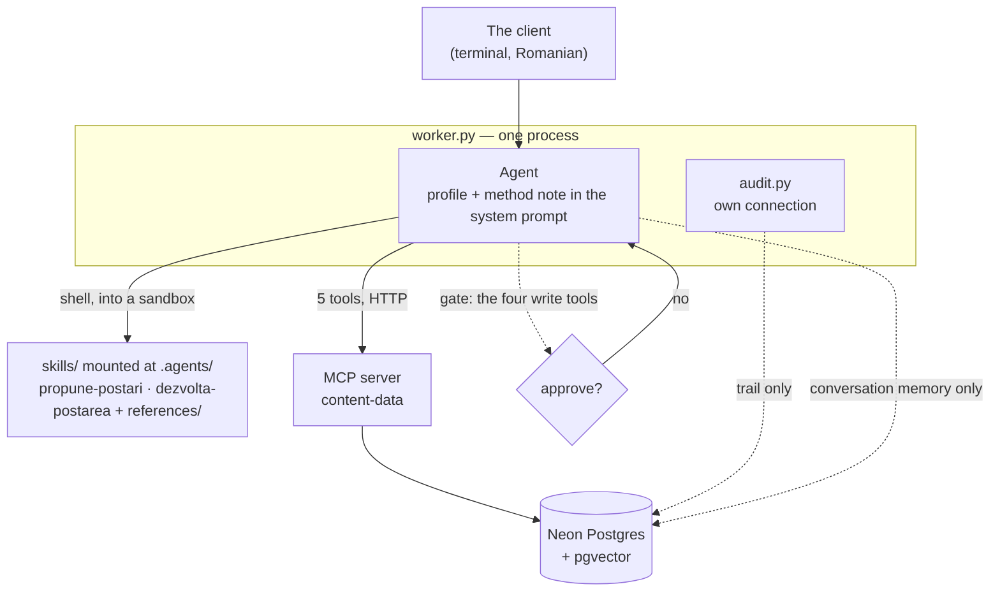

# Content Studio FTE

A **Digital FTE** — a digital full-time employee — rather than a chatbot with a
prompt. One agent does the work of a content assistant for a real
coaching business: it asks what it needs to know, gathers material from a private
library of 17 books or from the web, proposes ten posts, develops the one that is
chosen, and saves it only after a human says yes.

Built on the OpenAI Agents SDK, a purpose-built MCP server, and Neon Postgres with
pgvector. It runs in production for one client.

> **A note on language.** The agent works in Romanian, because the person it works
> for does. Everything the model reads at runtime — the system prompt, the tool
> descriptions, every file under `skills/` — is Romanian, and so is the terminal
> the client types into. Everything a developer reads — code, comments, docs,
> tests — is English. That split is deliberate and enforced throughout.

---

## What makes it more than a wrapper

Six architecture rules hold the design together. They are in [AGENTS.md](AGENTS.md),
and every one of them is visible in the code:

1. **Business data moves only through the MCP server.** The worker never runs SQL
   against the business tables. There is no `run_sql` tool, no DDL, and no tool
   takes free text that a query is built from. Five tools, and that is the whole
   surface.
2. **The audit trail has its own connection.** A write and its audit row commit in
   the *same transaction* — a saved post with no trail cannot happen, even if the
   connection dies between the two statements.
3. **One embedding model at both ends.** Store and search with
   `text-embedding-3-small`, always. Two different models return garbage without
   complaining, so every row carries the model it was made with.
4. **Skills are folders, not code.** `SKILL.md` plus a `references/` directory,
   delivered as tools and disclosed progressively: the description is always in
   context, the body opens when the task matches, a reference opens only when the
   skill asks for it by name. The method can be edited without touching Python.
5. **One agent, not a crew.** The two phases are skills, not separate agents — one
   context, so the 30k-character client profile is not copied twice.
6. **Nothing is saved without human approval.** The gate sits on the MCP server
   *registration*, not inside the tool, so it protects every call the agent can
   make regardless of what the prompt says.

## How it fits together



The dotted lines are the only direct database access the worker keeps: its own
conversation state and the audit trail. The profile, the books and the posts — the
business data — all travel through MCP.

### The seven tools

| Tool | Kind | What it does |
|---|---|---|
| `search_books` | read | meaning search over 4,778 chunks from 17 books, each with its page |
| `search_web` | read | current angles, with the links of the pages cited |
| `list_posts` | read | what has already been written — "have I covered this?" |
| `save_post` | **write, gated** | one post, plus its audit row, in one transaction |
| `save_posts_batch` | **write, gated** | the variants chosen in the UI, all of them or none |
| `update_post` | **write, gated** | one studio-written post, replaced whole |
| `update_profile` | **write, gated** | one profile section, plus its audit row |

Every passage returned by `search_books` carries its provenance — title, author,
page or chapter, rights basis, and whether the source was a summary rather than the
book. A quote with no page number never receives an invented one.

## Quickstart

Requires Python 3.13+, [uv](https://docs.astral.sh/uv/), a Neon Postgres database
and an OpenAI key.

```bash
git clone https://github.com/sorinLupaIonut/content-studio-fte
```

```bash
cd content-studio-fte && uv sync
```

Copy `.env.example` to `.env` and fill it in. The connection string from the Neon
console works as-is — `config.py` normalizes it for asyncpg.

```bash
uv run python -m content_studio.db.apply
```

```bash
uv run python -m content_studio.db.seed
```

Then two terminals. The MCP server in the first:

```bash
uv run content-studio-server
```

The worker in the second:

```bash
uv run content-studio
```

`content-studio` resumes the last conversation; `--new` starts a fresh one.

Or start the D1 HTTP harness instead of the terminal worker:

```bash
uv run content-studio-harness
```

`GET http://127.0.0.1:8000/health` reports the active backends without making a
model call. The interactive API contract is at
`http://127.0.0.1:8000/docs`. A missing dependency leaves health available as
`degraded`, but `/runs` refuses safely rather than replacing the Neon approval
gate with temporary state.

For the Blazor UI, open the repository in VS Code and choose the single compound
debug target `Studio complet (3 servicii)`. It starts `content-data`, FastAPI and
the .NET 10 WebAssembly development host on `5178`; no .NET extension is needed,
because the host runs as a command rather than under a .NET debugger. Local auth is
loopback-only. A Release publish places the SPA under `ui/StudioViorela/dist/wwwroot`,
which FastAPI serves at `/` — the shape the Azure container has, and the one the
`Studio ca in container (MCP + harness)` compound reproduces on `8000`:

```bash
dotnet publish ui/StudioViorela/StudioViorela.csproj -c Release
```

To fill the library, put Markdown files in `content/books/md/` and run
`uv run python -m content_studio.db.import_books`. The import is per-book and
content-addressed: unchanged books are skipped, so adding an eighteenth title only
embeds that one.

**Upgrading a database created before the English rename:**

```bash
uv run python -m content_studio.db.migrate rename --apply
```

It is idempotent, it moves tables, columns, constraints and JSONB keys, and it does
not touch the vectors.

## Layout

```
src/content_studio/
  worker.py            the agent and the conversation loop
  audit.py             durable runs, replayable trail, and approval gate
  harness/             FastAPI control plane: runs, generator and streaming chat
  replay.py            reconstructs a past conversation, no model involved
  config.py            environment, paths, DATABASE_URL normalization
  mcp_server/          the `content-data` server: seven tools, one resource
  db/                  schema, migrations, seed, book import

ui/StudioViorela/      .NET 10 Blazor UI: profile, generator and streaming chat

skills/                one tool each; Romanian, edited without code
  propune-postari/       phase 1: three questions, then 10 proposals × 5 hooks
  dezvolta-postarea/     phase 2: develop the chosen one, then save it

tests/unit/            free, no network — these run in CI
tests/checks/          checks against the real services, from cheapest to fullest
evals/                 15 cases: the ugly ones, plus three trigger evals
docs/                  architecture, testing, the runbook, and the owner's manual
```

## Testing

Four rungs, from free to expensive. The ladder is described in
[docs/TESTING.md](docs/TESTING.md).

```bash
uv run python -m unittest discover -s tests/unit
```

```bash
uv run python tests/checks/safe/bootstrap.py
```

```bash
uv run python evals/route/tool_usage.py --dry-run
```

```bash
uv run python tests/checks/paid/full_flow.py
```

The evals are the interesting part, and they measure the ways this kind of agent
fails quietly — a reference that never loaded, an invented page number, a quote
attributed to a book that was only a summary, a skill that fired on a question
that was only a report. They are grouped by the question each answers; today
that is `evals/route/` — did the run reach the method and call the right tools.
The map, including what the other three groups measured before they were removed
on 2026-08-30, is [evals/README.md](evals/README.md).

## Where it stands

| # | Decision | State |
|---|---|---|
| 0 | Minimal chat agent — uv, Agents SDK | ✅ |
| 1 | The architecture rules | ✅ |
| 2 | Schema and flow planned, with the reason for each choice | ✅ |
| 3 | Neon + pgvector + schema, then `SQLAlchemySession` | ✅ 7 tables, memory across restarts |
| 4 | `propune-postari` as a folder skill | ✅ 10 proposals × 5 hooks |
| 5 | Import + embedding of the 17 books | ✅ 4,778 chunks, search returns the page |
| 6 | `content-data` MCP server, seven tools | ✅ books, web, posts, guarded writes |
| 7 | `dezvolta-postarea` + saving | ✅ full cycle, and a second post from the same list |
| 8 | Audit at every boundary + replay | ✅ trail tied to the conversation, replayable |
| 9 | Approval gate on both write tools | ✅ refused = `blocked`, approved = written |
| 10 | The eval set — 12 ugly cases + 3 trigger evals | ✅ real runner |
| 11/D1 | FastAPI harness + durable HTTP approval gate | ✅ free contract tests; paid round trip deferred to the testing stage |
| D1b.1 | secure Blazor shell + structured profile | ✅ local/Azure identity adapters, gated section save |
| D1b.2 | title-first progressive generator | 🟡 API, durable orchestration, SSE and UI built; accepted real 10 × 5 run pending |
| D1b.3 | synchronized streaming chat | 🟡 target-aware SSE, stop and validated draft patches built; saved-post approvals next |

Next: accept one real hybrid 10 × 5 run, add atomic saved-post approvals and the
saved editor, then containerize the accepted core for Azure Container Apps.

## Documentation

- [AGENTS.md](AGENTS.md) — the contract, for humans and for coding agents
- [docs/ARCHITECTURE.md](docs/ARCHITECTURE.md) — why it is built this way
- [docs/TESTING.md](docs/TESTING.md) — how to verify it, rung by rung
- [docs/RUNBOOK.md](docs/RUNBOOK.md) — what to do when it breaks, written
  before it breaks
- [docs/manual.html](docs/manual.html) — the owner's manual: the whole system in
  one place, diagrams included (open it in a browser)

Built following [Building a Digital FTE](https://agentfactory.panaversity.org/docs/digital-fte-crash-course),
Part 4.

## License

MIT — see [LICENSE](LICENSE). The client's profile, her published posts and the
book library are her material, not part of the license: the books are gitignored,
and `content/` holds only what she agreed to keep in the repository.
