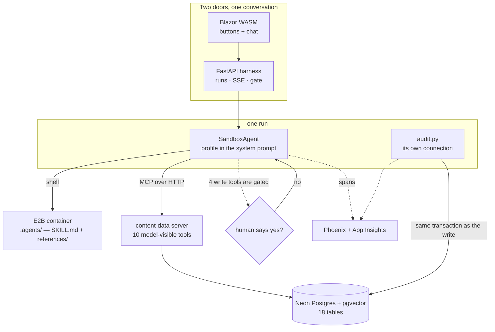
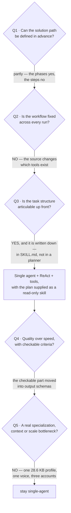
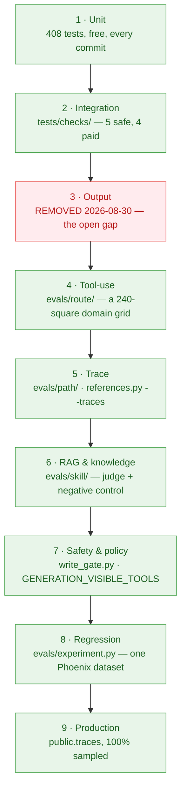
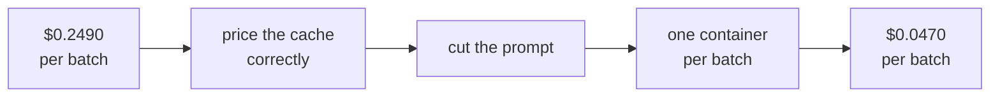

# Content Studio FTE — an engineering case study

A production **Digital FTE**: one agent that does a content assistant's job for a
real coaching business. It asks what it needs to know, gathers material from a
private library of 17 books or from the live web, proposes ten posts, develops the
chosen one, and saves nothing without a human "yes".

This document is the reasoning, not the README. It covers four things: the
architecture that was chosen and the four that were rejected, the evaluation
discipline built on top of it, what the whole thing costs and how that cost was
brought down by 5×, and the defects that only appeared because something was
measuring.

| | |
|---|---|
| **Runtime** | OpenAI Agents SDK (Python 3.13), one `SandboxAgent` |
| **Data plane** | purpose-built MCP server, 10 model-visible tools, 25 internal |
| **System of record** | Neon Postgres + pgvector, 18 tables |
| **Method** | 2 skill folders, 107 KB, mounted into an E2B container per run |
| **Interface** | .NET 10 Blazor WebAssembly + FastAPI control plane |
| **Observability** | OpenTelemetry → Application Insights + Arize Phoenix, 100% sampled |
| **Scale of the code** | 12,969 lines of Python in `src/`, 4,598 lines of C#, 408 unit tests |
| **Corpus** | 17 books → 4,778 embedded chunks; a 28,639-character client profile |

---

## 1. The problem, and the constraint that shaped everything

A life coach publishes to Instagram: reels, carousels and stories, across five
content pillars. The work is not writing — it is *method*. Which pillar this week,
which hook type, which passage from which book, which angle, and never repeating
last month's idea with new words.

The constraint that decided the architecture: **the method belongs to her, and she
has to be able to change it without a developer.** That single requirement rules
out putting the method in a prompt string, and it rules out putting it in Python.

The second constraint: **she pays for the tokens.** Not a company card — hers. A
design that is 5× more expensive than it needs to be is a design that gets
switched off.

---

## 2. The architecture: a Digital FTE

Built on the [Digital FTE](https://agentfactory.panaversity.org/docs/digital-fte-crash-course)
pattern, which is a chat agent grown up: same runtime, surrounded by the
infrastructure that makes it durable, auditable and reusable. Three shifts define
it, and all three are load-bearing here.



### Shift 1 — capabilities move out of code, into skill folders

The method lives in `skills/propune-postari/SKILL.md` and
`skills/dezvolta-postarea/SKILL.md`, plus a `references/` directory. 107 KB of
Romanian prose, edited in a text editor, no deploy.

It reaches the model through the SDK's own `Skills` capability, mounted into an
E2B container under `.agents/`. Progressive disclosure in three steps, and all
three belong to the platform:

1. `Skills.instructions` puts **name + description + path** into the system
   prompt, off the frontmatter. The description alone decides whether the body is
   ever paid for.
2. The model opens `SKILL.md` with the shell when the task matches.
3. The body names a file in `references/` and the model opens that too.

**This shape was removed once and brought back, and the numbers are why.** In
August the container was deleted after measurement: of 148 KB mounted, a
generation run opened one file and never touched `references/`, while the SDK's
default prompt and tool schemas cost 5,448 tokens *per call*. Tools replaced it.
Then the replacement drifted the other way — a `method.py` that preloaded the
whole method on the generation path, which bought one turn and 26,250 input tokens
against five turns and 84,269 fetching it, at the price of a duplicate
format→references table living in Python that had to keep agreeing with the prose.
The standard shape came back with two corrections that stop it costing what it
cost the first time:

- **`base_instructions` is overridden.** The SDK default is a 16.9 KB
  coding-agent prompt that tells the model to write preambles and structure a
  final answer — the opposite of both this project's system prompt and its
  output schemas.
- **Capabilities are Shell + Skills only.** `Capabilities.default()` adds
  `apply_patch`, which is a tool for editing the method the agent is supposed to
  be reading.

**The failure mode of this shape does not raise.** A model that never opens the
file still answers, plausibly. Measured on the first live run: `gpt-5-nano` called
the shell twice with the bare command `bash`, read nothing, and produced ten
believable titles. `gpt-5-mini`, minutes later, ran `sed -n '1,200p'` over the
whole file. Nano was removed from the allowlist that day. This is the single
reason the eval suite in §4 exists in the shape it does.

### Shift 2 — durable state moves into a system of record

Neon Postgres with pgvector. 18 tables, and the interesting ones are not the
business tables:

| Table | What it makes possible |
|---|---|
| `documents` + `embeddings` | 4,778 chunks, each with page/chapter, rights basis, owner, and **the embedding model it was made with** |
| `audit_log` | every action, committed in the same transaction as the action |
| `runs` | a run serialized mid-flight, so an approval can be answered hours later by a different process |
| `usage_events` | integer micro-dollars per call — no floats anywhere near money |
| `traces` | what was answered *and* how it was reached, same `run_id` |
| `conversations` | which session is active and which batch was born in it |
| `clients` / `app_users` | a link table, because a principal id belongs to the identity provider, not to a person |

The one rule that keeps this honest: **an action and its audit row commit
together, in one transaction.** A saved post with no trail cannot exist even if
the connection dies between the two statements. `save_posts_batch` widens the same
promise to ten posts and ten trail rows.

### Shift 3 — access wires through MCP

The worker never runs SQL against business tables. There is no `run_sql` tool, no
DDL, and no tool takes free text that a query is built from. Ten tools are visible
to the model; 25 more are internal UI operations hidden behind the SDK's tool
filter. A check asserts the exact surface on every run, and fails if any tool name
contains "sql".

Two consequences that are easy to miss:

- **The client is resolved from the connection, never from a tool argument.** A
  client the model can name is a client the model can get wrong. `client_of(ctx)`
  reads a header, falls back to the principal in `app_users`, then to a
  configured default.
- **The approval gate sits on the MCP server *registration*, not inside the tool
  body.** It therefore protects the write no matter who calls the tool or what
  the prompt says.

---

## 3. Why not one of the other four architectures

The [architecture-selection framework](https://agentfactory.panaversity.org/docs/choosing-agentic-architectures-crash-course)
offers five patterns and a five-question decision tree. Here is the tree, answered
for this project.



| Pattern | Why not |
|---|---|
| **Sequential workflow** | The path is not fixed. `Memorie` calls no tool, `Cărți` calls one, `Internet` calls another, `Combinat` calls either or both — four different shapes from one form. A fixed pipeline would have to branch four ways and would still be wrong the first time a fifth source is added. |
| **Planning + ReAct** | The high-level structure *is* articulable — but it is already written down, by the domain expert, in `SKILL.md`. Adding a planning agent would mean paying a model to re-derive, every run, a plan that exists as prose she maintains. The plan is an input here, not an output. |
| **Reflection layer** | Tried, in effect, and replaced by something cheaper. The criteria that are genuinely checkable — "exactly ten proposals", "five hook types", "ten distinct angles" — moved into the **output schema** instead of a critique pass. OpenAI enforces `enum`, `pattern` and `minLength` *while the model writes*, so a structural rule costs no second call. Measured: with "make them different" as prose 3,800 tokens above the schema, one batch proposed delegation twice and boundaries twice (closest title pair 0.629); with ten named archetypes as ten schema slots, the closest pair fell to 0.475. A reflection pass would have cost 2–5× the latency to catch what a schema now prevents. |
| **Multi-agent specialists** | The honest bottleneck test fails. The two phases look like two specialists, and they are two *skills* instead — because the shared context is a 28,639-character client profile plus her voice rules, and splitting the work would copy that into a second context window. The cost multiplier is 5–20×, against three accounts and a client paying her own bill. The price of staying single-agent is stated openly in the contract: a `SKILL.md` is text, not a schema, so "exactly ten proposals" is asked for, counted afterwards, and graded in the evals. |

**The principle applied:** *pick the simplest pattern whose assumptions match the
task's actual properties.* One agent, with the plan handed to it as a folder it
reads, and the hard structural rules pushed down into the output contract.

The interesting corollary, and the rule this project ended up writing for itself:

> What a `SKILL.md` cannot enforce, a schema can — and the schema is where it
> goes. A rule that belongs to the method still lives in the skill; only what has
> a field to sit next to moves into a contract.

---

## 4. Eval-driven development: the nine-layer pyramid, layer by layer

The [EDD discipline](https://agentfactory.panaversity.org/docs/eval-driven-development-crash-course)
describes nine layers, each catching failures the layers below cannot see. Here is
what exists in this repository against each one — including the two that do not.



### Layer 1 — Unit tests · `tests/unit/`, 408 tests, free

Deterministic code only: URL normalization, schema validation, profile section
parsing, the pricing table, the conversation summary. They also hold two
non-obvious invariants that would otherwise drift silently:

- the frontmatter of every skill parses **identically under this project's YAML
  reader and under the SDK's own line-based reader**. That mismatch shipped once:
  `description: >-` was read by the SDK as the literal two characters `>-`, so
  step 1 of progressive disclosure — the step that decides whether the body is
  ever opened — was running blind for both skills;
- the search rule is one rule written in two `SKILL.md` bodies, and a test keeps
  the copies byte-equal.

### Layer 2 — Integration · `tests/checks/`, five safe and four paid

Real MCP, real Neon, real OpenAI, no grading. The tool surface, the profile over
MCP, ranked passages with page numbers, a live web search, and — the important
one — `write_gate.py`, which creates a conversation, simulates a *refused* write,
saves one dummy post, asserts the transactional audit landed, and deletes every
row it created in a `finally`.

### Layer 3 — Output evals · **missing, and that is the honest answer**

There is no automated grader on what the studio *writes*. A group existed and was
removed on 2026-08-30, deliberately: it had last measured before the sandbox
returned and before the reasoning-budget fix, so its numbers described code that
no longer existed. `evals/README.md` keeps the question each removed group asked,
so a rebuild starts from the question rather than from stale code.

**What this means in practice:** hook quality, voice fidelity and "does this sound
like her" are checked by eye today. That is the top item on the backlog, and
naming it is more useful than pretending a stale number covers it.

### Layer 4 — Tool-use evals · `evals/route/tool_usage.py`

The domain is four axes — format × pillar × source × focus — across two phases:
**240 real combinations, every one of them a run the interface can actually
produce.** Each square carries a label: which `SKILL.md`, which `references/`
files are *required* and which are *forbidden*, which search tool is required,
forbidden, or `any_of`.

Two design decisions worth defending in an interview:

- **The label is composed from two manifests, never copied into a third.** The
  format half lives in `references.json`, the source half in
  `tool-usage-grid.json`. The moment a third copy exists it goes stale in silence
  and reports a fault on every square it touches.
- **`Combinat` is labelled `any_of`, honestly.** The form offers one button and
  the method says "only the sources she chose" — which sources those are is a
  thing the form never asked. Tightening that label needs a form change, not a
  sharper eval. An eval that invents an expectation the method never wrote is
  measuring itself.

The default run is the **spine**: 24 squares, one per distinct label. `--all` runs
the whole grid and takes hours.

### Layer 5 — Trace evals · `evals/path/convergence.py`, `evals/route/references.py --traces`

The full execution path, two ways.

**Path economy under rephrasing.** One request said ten ways — dictated,
telegraphic, colloquial, without diacritics, thinking aloud — and the score is
`shortest / your own length`. The anchor is the sentence the button dictates,
*built at run time* from the same function the button calls, so the manifest holds
no second copy of a string the contract owns. Result: mean 0.903 over nine paths,
8/10 recorded the request exactly, one hard failure.

**What a real run actually opened.** `public.traces` records every span with the
same `run_id` the logs and the audit rows carry, so the question "did this run
open the file" can be asked of production traffic, after the fact, for free.

### Layer 6 — RAG and knowledge evals · `evals/skill/`

The route layer reads a tool call's **name**, so a search that timed out still
counts as called. This layer asks the next question: *did the search bring back
material for this brief?*

Two steps, in the lab's order. `run_cases.py` runs ten cases through production's
own pipeline and prints every search with what was asked and what came back — how
many characters, or the error. That alone separates two faults with two different
fixes: on 2026-08-30, **ten of eighteen "bad retrieval" failures turned out to be
tool timeouts**, which had been counted as irrelevance.

Then `relevance.py` judges the spans. What the judge is shown is the interesting
part: the brief, the request the model composed, the material that came back, and
**the client's avatar** — her needs, desires, pains, fears and beliefs, imported
from the same function that shows them to the writer, so the two cannot drift.

**The negative control.** One of the ten cases asks for a focus the form happily
accepts and the avatar has nothing to do with: *"how to choose winter tyres for an
SUV."* It expects the verdict `irrelevant`, and it passes by being refused. Nine
cases that all come out `relevant` look identical whether the metric works or the
judge says yes to everything.

That control took two attempts, which is itself the lesson. The first was *"how to
pick an investment fund with low fees"* — and it failed for the wrong reason: the
shelf simply had nothing about funds. The judge wrote that the avatar has "a need
for financial security", and it does. A control that fails because the shelf was
empty proves nothing about the avatar. Tyres have no overlap at all *and* the web
genuinely has good material about them — so the only remaining reason to fail is
the client herself, which is exactly what the control has to demonstrate.

### Layer 7 — Safety and policy evals

Not a document — three mechanisms, each with a test:

| Mechanism | What it guarantees |
|---|---|
| Gate on the MCP **registration** | every write is interrupted before the call, whoever calls it |
| `GENERATION_VISIBLE_TOOLS` | during unattended generation the model is shown **two read-only tools and nothing else** — there is no write to refuse, because there is no write tool |
| `write_gate.py` | asserts both directions: refused → `capability_blocked`, approved → `capability_invoked` + one row + one trail row |

The reasoning behind the second is worth stating plainly: `Runner.run` treats an
interruption as a hard failure of the whole batch, because there is no human on
that path to answer. Rather than trust a cheap model not to reach for a write
tool, the safe fix is to never show it one.

### Layer 8 — Regression evals · `evals/experiment.py`

Built on 2026-08-30, and the newest layer here. Before it, each group ran its own
loop and wrote its own report file, and two of them were joined only by a *time
window* — one made spans, the other graded whatever spans the last few minutes
happened to hold.

This replaces the window with a **dataset**. Ten cases uploaded once to Phoenix;
the runs are one experiment against them; six scores land on the run they belong
to. Two experiments a week apart are a comparison, not two reports somebody has to
read side by side.

| Score | Kind | Question | First full run |
|---|---|---|---|
| `router` | code | right `SKILL.md`? | **10/10** |
| `references` | code | exactly the format's references? | **9/10** |
| `tools` | code | the tool the source requires? | **10/10** |
| `relevance_books` | LLM judge | was the shelf's answer any good? | **7/7** |
| `relevance_web` | LLM judge | was the web's answer any good? | **6/6** |
| `convergence` | code | path length vs. the shortest correct one | **mean 0.902** |

Three implementation details that are the actual engineering:

- **Relevance is two evaluators, not one.** A `Combinat` run makes two searches, a
  `Cărți` run makes one. Each evaluator judges only its own tool's searches, so
  every search is judged exactly once and the per-tool rate is a native column.
- **A tool that was correctly *not* called returns no score at all** — not a zero.
  A `Cărți` run must not call `search_web`; scoring that 0.0 would print the
  correct route as a failed search. Phoenix shows a blank cell.
- **The optimum is taken only over runs that passed the route.** The reference
  implementation takes `min(turns)` outright and can — every path in it reaches
  the same SQL answer. Here the named failure mode, a model that never opens the
  method, produces a *shorter* path. It would become the floor and score every
  honest run below a run that did nothing.

The single failure in that run is worth more than the nine passes: one case opened
**no references at all** while its format's file was required — the named failure
mode, caught in the act, n=1.

### Layer 9 — Production evals · `public.traces`, Phoenix, 100% sampling

One `run_id` is born in `Audit.open_run` and reaches four places: every log line,
the OpenTelemetry span, the rows in Neon, and the agent's own spans. Nothing
passes it as a parameter.

**Sampling is 100%, and it had to be asked for.** The reference course samples a
tenth of successes because it assumes production traffic. Three accounts is not
production traffic, and dropping nine runs in ten discards the only evidence of a
weekly fault. This was a *claim* before it was a *fact*: `configure_azure_monitor`
with no sampling argument installs a rate-limited sampler at five spans per
second, which was quietly keeping 319 records out of 490 requests. A unit test
holds `sampling_ratio=1.0` now.

**The trace-to-eval pipeline is half-built, honestly.** Traces are durable,
queryable and replayable, and `references.py --traces` grades real production runs
off them. What does not exist yet is automatic promotion of an interesting trace
into a dataset row — today that is a human reading a report and adding a case.

### What the pyramid caught that nothing else would have

| Layer | The defect | Invisible to |
|---|---|---|
| 4 | `reasoning: "minimal"` left no budget for the second errand — 15 of 16 runs fetched the reference **or** called the tool, never both | every layer below; nothing raised, all 16 produced posts |
| 6 | ten of eighteen "irrelevant retrieval" failures were **tool timeouts** | the tool-use layer, which reads the call's name |
| 8 | a run that opened no references while writing a Stories post | output inspection — the post looked fine |
| 1 | both skill descriptions indexed as the literal string `>-` | everything; the agent still answered |
| 2 | the whole end-to-end check had been dead since the sandbox returned | CI, which never ran it |

---

## 5. Cost engineering

The client pays for her own tokens, so cost is a feature. One batch of ten ideas
went from **$0.2490 to $0.0470** — 5.3× — without changing the model.



**Four levers, in the order they mattered:**

1. **The cache was being charged at the full rate.** Measured over one batch,
   826,880 of 963,852 input tokens — **86%** — were prompt-cache reads, which bill
   at a tenth. Every budget in the system was draining 2.8× too fast. The fix is
   a third figure in the price table and a `cached_input_tokens` column, and the
   correction is deliberately **not** retroactive: a row keeps the price it was
   charged on the day, or last month's total silently rewrites itself.
2. **The ten output rules left the prompt.** They were 3,800 tokens above the
   schema and enforced nothing the schema could not enforce better. What survives
   in the system prompt is identity and voice.
3. **One container per batch, not per run.** A batch is eleven runs — one for the
   titles, ten for the details — sharing one E2B container. Per-run containers
   would pay the startup and the 107 KB upload eleven times for a filesystem that
   never changes.
4. **`reasoning: "minimal"` was a false economy, and this is the best story in
   the file.** Phase 2 has to fetch two things before it writes — the format's
   reference file, and the source's material. Across 16 runs covering every format
   and every source, **15 did exactly one of them.** Every run that skipped
   something took exactly nine turns; the one that did both took twelve. The turn
   limit was 20, so nothing was truncated — the model stopped itself.

   The cause was `reasoning={"effort": "minimal"}`, kept from lever 2's cost work:
   measured `reasoning_tokens: 0` on every span. A four-step errand asked of a
   model told not to plan. Raising it to `"low"` on the detail phase alone:

   | | minimal | low |
   |---|---|---|
   | spine passing | 3/12 | **12/12** |
   | runs that did both errands | 1 of 16 | **9 of 9** |
   | `Invalid JSON` failures | 6 (all at the largest format) | **0** |
   | slowest square | 1,095s | **466s** |
   | prompt cache hit | 97% | **98%** |

   It cost 640 reasoning tokens, about **$0.0013 a run**, and the cache survived
   intact — effort is a request parameter, and caching matches the input prefix.
   Phase 1 stays `minimal`: it opens no files, so it has nothing to buy.

   The hours before that fix were spent rewriting the skill prose, and the lesson
   is written into the contract for whoever meets it next: **when every repair
   trades one score for another, the budget is exhausted — and a budget is a
   setting, not a wording.**

### The budget gate

A lifetime allowance per account, in **integer micro-dollars**, no floats
anywhere. It is a *stop-gate, not a ceiling*: cost is only known after a call
returns, so the gate refuses to **start** — before a batch, before each idea, and
again inside the task that writes it. The user is shown a percentage and nothing
else; the split is server-side, because hiding a figure in the interface would not
hide it.

**A run that fails still spent the money, and the meter has to see it.** Metering
used to happen only after `Runner.run` returned, so a missed structured contract
or a turn limit left no row at all. Measured against `public.traces`, which
records spans either way: one batch consumed $0.0195 and recorded $0.0061; another
consumed $0.1019 against $0.0770. The gap scales with the failure rate — backwards
for a gate meant to stop runaway spending. Usage is taken off a `RunHooks` now,
and deliberately **not** off `exception.run_data`, which the SDK detaches on
exactly the redaction path a structured-output failure takes.

---

## 6. Five defects that only appeared because something was measuring

The section an interview actually turns on.

**1 · The model that never opened the method.** `gpt-5-nano` called the shell
twice with the bare command `bash`, read nothing, and produced ten plausible
titles. Nothing raised. Found by a fidelity check that opens a real container and
compares every mounted file byte for byte, plus a warning when a run wrote without
opening the method. Nano left the allowlist.

**2 · Both skill descriptions indexed as `>-`.** The frontmatter is read by two
parsers and only one of them is this project's. The SDK's line-based reader does
not understand YAML block scalars, so `description: >-` became the literal two
characters. The step that decides whether the body is ever opened was running
blind. Found by assembling the prompt and *reading it* — a script that shows the
whole model input without paying for a run.

**3 · Every tool result fell beside its own call, silently.** The two halves of a
call arrive in two shapes: the call is an object with a `.call_id` attribute, its
output is a `TypedDict` handed over as a plain dict. Matching by attribute alone
paired nothing, and every `result` came back `None` while every `name` and
`arguments` looked correct. It stayed invisible because both readers in `src/`
want the arguments and neither ever asked for the result. The first caller that
did was an eval.

**4 · The web search stopped fitting inside its own timeout.** `search_web` was
changed to return passages with provenance instead of a model-written synthesis —
strictly better material, and slower. Three consecutive real searches took 80s,
55s and 40s against a 90-second MCP ceiling. The integration check duly timed out,
which is the *good* version of this failure; the bad version is a generation run
losing its material and writing from memory, because an MCP timeout comes back as
a short error string rather than as an exception the run can see.

**5 · The one model call the budget could not see.** Every other call is made by
the harness, which reads usage off a `RunHooks`. `search_web` is made inside the
MCP server with its own client, so nothing was watching, and any run on `Internet`
or `Combinat` spent money the gate never counted. The schema had listed
`web_search` among the kinds since the table was written; it was waiting for a row
that never came. Fixed, and verified live: four searches, four rows, $0.041.

---

## 7. Running it

```bash
uv run python -m unittest discover -s tests/unit
```

```bash
uv run python tests/checks/safe/bootstrap.py
```

```bash
uv run python evals/route/fidelity.py
```

```bash
uv run python evals/experiment.py --dry-run
```

The full ladder, cheapest first, is [docs/TESTING.md](TESTING.md); the eval map is
[evals/README.md](../evals/README.md); the rules that must not be rediscovered are
[AGENTS.md](../AGENTS.md).

---

## 8. What is not done

Stated plainly, because a case study that claims completeness is not credible:

- **Layer 3, output evals, is empty.** Nothing automated grades what the studio
  writes. Highest-value next build.
- **The trace-to-eval loop is manual.** Traces are durable and queryable; nothing
  promotes an interesting one into a dataset row automatically.
- **The evals assert Romanian only.** The interface is bilingual; the graders are
  not.
- **`Memorie` is outside the relevance dataset** by construction — a source whose
  correct behaviour is "call nothing" leaves a judge nothing to read. It is
  covered at the tool-use layer instead, which is the right layer for it.
- **Regression baselines are one run deep.** The dataset that makes comparison
  possible was built on 2026-08-30; the second experiment is the first real
  regression signal.
